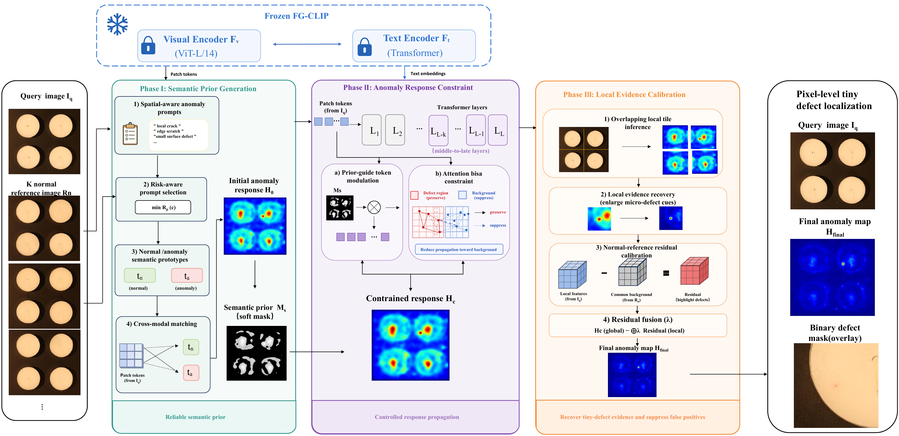

# SARC

论文 **《Semantic-Guided Anomaly Response Constraint for Few-Shot Localization of Tiny Industrial Defects with Frozen Vision-Language Models》** 的研究代码。

SARC 仅使用正常参考图像，并保持 FG-CLIP 主干冻结。公开流程严格对应论文中的三个阶段：

- **SP（Semantic Prior Generation，语义先验生成）**：空间感知异常提示、风险感知提示选择和跨模态语义先验生成。
- **ARC（Anomaly Response Constraint，异常响应约束）**：在视觉 Transformer 中进行先验引导的 token 调制与注意力偏置约束。
- **LEC（Local Evidence Calibration，局部证据校准）**：重叠局部推理、局部/全局融合和正常参考残差校准。

## 总体框架

<p align="center">
  
</p>

## 安装

```bash
git clone https://github.com/hec98047-commits/SARC.git
cd SARC
conda env create -f environment.yml
conda activate sarc
```

也可以执行 `pip install -r requirements.txt` 安装 Python 依赖。

仓库只包含不带权重的模型代码和配置：

- `models/FGCLIP/`：冻结的 FG-CLIP 主干定义；
- `models/SARC/`：SARC 模型定义及启用 ARC 的视觉配置。

请在本地准备预训练权重和 tokenizer。权重、数据集、缓存、日志以及运行生成结果均不会上传到 Git。

## 数据与协议

按照 VisA 或 MVTec AD 官方目录格式准备数据。每个类别使用随机种子 `42` 采样 `K = 1、2、4` 张正常参考图像；优化过程不使用异常训练图像和测试掩码。

修改 `configs/release_visa.yaml` 或 `configs/release_mvtec.yaml` 后运行：

```bash
python src/sarc/run_sarc_protocol.py --config configs/release_visa.yaml
```

也可使用单个 shot 的便捷脚本：

```bash
bash scripts/run_visa_1shot.sh /path/to/visa /path/to/FGCLIP /path/to/SARC outputs/visa_1shot
```

运行时，方法阶段只显示 `SP`、`ARC` 和 `LEC`。

## ARC 训练

ARC 中仅轻量 token 调制器参与训练，FG-CLIP 主干保持冻结。

```bash
python src/sarc/train_arc.py \
  --dataset visa \
  --data_root /path/to/visa \
  --sampled_normals outputs/samples/1shot/sampled_normal_paths.json \
  --model_dir /path/to/SARC \
  --output_dir checkpoints/visa_1shot_seed42
```

## VisA 指标

像素级 AUROC（P-AUROC）与区域重叠指标（AU-PRO）均以百分数表示。

| 类别 | 1-shot P-AUROC | 1-shot AU-PRO | 2-shot P-AUROC | 2-shot AU-PRO | 4-shot P-AUROC | 4-shot AU-PRO |
|---|---:|---:|---:|---:|---:|---:|
| candle | 97.86 | 97.12 | 98.18 | 97.94 | 98.36 | 97.82 |
| capsules | 96.41 | 89.92 | 96.38 | 90.44 | 95.73 | 89.61 |
| cashew | 96.89 | 85.88 | 96.35 | 82.19 | 97.15 | 89.14 |
| chewinggum | 99.34 | 88.41 | 99.22 | 88.15 | 99.50 | 89.27 |
| fryum | 96.89 | 91.70 | 97.05 | 91.50 | 97.12 | 91.52 |
| macaroni1 | 99.47 | 97.98 | 99.66 | 98.93 | 99.95 | 98.60 |
| macaroni2 | 98.47 | 92.09 | 98.29 | 92.85 | 98.64 | 92.30 |
| pcb1 | 98.88 | 85.04 | 98.82 | 83.00 | 99.20 | 87.36 |
| pcb2 | 96.16 | 91.33 | 96.86 | 93.36 | 96.81 | 93.30 |
| pcb3 | 95.21 | 91.20 | 94.81 | 91.43 | 94.76 | 92.56 |
| pcb4 | 95.94 | 89.71 | 96.39 | 92.11 | 96.52 | 91.88 |
| pipe_fryum | 99.45 | 89.33 | 99.56 | 90.22 | 99.70 | 90.71 |
| **平均值** | **97.58** | **90.81** | **97.63** | **91.01** | **97.79** | **92.01** |

## 定性可视化

<p align="center">
  
</p>

## 仓库结构

```text
SARC/
├── assets/          # 论文框架图与定性可视化
├── configs/         # 正式发布协议
├── models/          # FG-CLIP 主干和 SARC 模型定义
├── scripts/         # 1/2/4-shot 启动脚本
├── src/sarc/        # SP、ARC、LEC 实现与评估
├── .gitignore
├── LICENSE
├── README.md
├── README_CN.md
├── environment.yml
└── requirements.txt
```

## 许可证

本仓库采用 MIT License。第三方数据集和预训练模型遵循各自的原始许可证。
