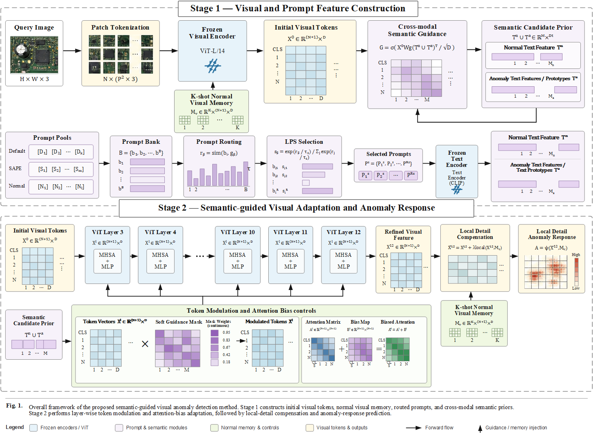

# PGCRE-FGCLIP

PGCRE-FGCLIP 面向**仅使用正常参考图像的少样本微小工业缺陷定位**。发布协议采用每类 `1/2/4-shot` 正常参考图像并固定随机种子为 `42`，训练过程不使用异常图像和测试掩码。

> 本仓库只提供源码、配置与运行示例，不上传数据集、预训练权重、TokenMod 检查点、实验输出、日志或缓存。

## 方法框架

<p align="center">
  
</p>

整体方法由三个模块组成：

- **Module A——跨模态语义对齐增强**：通过空间感知提示、低风险提示路由和语义候选先验确定潜在缺陷区域。
- **Module B——候选引导的局部响应解耦**：利用正常参考图像训练共享的轻量 CandidateTokenModulator，并将其应用于冻结视觉 Transformer 的第 3–12 层；注意力偏置不包含可训练参数。
- **Module C——局部细节补偿**：通过重叠局部推理、正残差融合和正常参考校准恢复微弱缺陷证据并抑制假阳性。

唯一可训练部分是 Module B 中的 CandidateTokenModulator。视觉编码器、文本编码器、注意力层以及其他模块均保持冻结。运行日志只显示 `Module A`、`Module B` 和 `Module C`，不显示论文章节编号。

## 安装

推荐使用 Python 3.10 和与本机 CUDA 驱动兼容的 PyTorch。

```bash
git clone https://github.com/hec98047-commits/PGCRE-FGCLIP.git
cd PGCRE-FGCLIP
conda env create -f environment.yml
conda activate pgcre-fgclip
```

也可以直接安装依赖：

```bash
pip install -r requirements.txt
```

## 数据与权重

请从官方渠道获取 MVTec AD 与 VisA，并将数据集和权重保留在 Git 版本控制之外。

```text
/path/to/mvtec/
  bottle/
    train/good/*.png
    test/good/*.png
    test/<defect_type>/*.png
    ground_truth/<defect_type>/*_mask.png

/path/to/visa/
  split_csv/1cls.csv
  <category>/...
```

`models/FGCLIP/` 和 `models/MGFGGCLIP/` 中只保留模型结构与配置，不包含预训练权重和 tokenizer 资源。

## 训练 Module B

首先固定种子并抽取正常参考图像：

```bash
python src/pgcre_fgclip/fewshot_sampler.py \
  --dataset visa \
  --data_root /path/to/visa \
  --shots 1 \
  --seed 42 \
  --output_path outputs/samples/visa_1shot_seed42.json
```

然后进行 CandidateTokenModulator 的正常样本训练：

```bash
python src/pgcre_fgclip/train_candidate_token_modulator.py \
  --model_dir /path/to/MGFGGCLIP \
  --sampled_normals outputs/samples/visa_1shot_seed42.json \
  --output_dir checkpoints/visa_1shot_seed42 \
  --epochs 10
```

复现 2-shot 与 4-shot 时分别修改 `--shots`。默认检查点路径为：

```text
checkpoints/{dataset}_{shot}shot_seed{seed}/ctm_epoch10_trained.pt
```

## 运行评估

修改 `configs/release_visa.yaml` 中的占位路径，或通过命令行覆盖：

```bash
python src/pgcre_fgclip/run_fewshot_protocol.py \
  --config configs/release_visa.yaml \
  --data_root /path/to/visa \
  --model_path /path/to/FGCLIP \
  --mg_model_path /path/to/MGFGGCLIP \
  --output_dir outputs/visa
```

MVTec AD 使用 `configs/release_mvtec.yaml`。P-AUROC 和 AU-PRO 会写入 `eval_metrics.json` 与汇总 CSV。AU-PRO 实现位于 `src/pgcre_fgclip/fgclip_ad/metrics.py`，FPR 积分上限为 `0.3`。

## VisA 实验结果

**表 B1 PGCRE-FGCLIP 在 VisA 数据集 1/2/4-shot 协议下的类别级结果（%）。**

| 类别 | 1-shot P-AUROC | 1-shot AU-PRO | 2-shot P-AUROC | 2-shot AU-PRO | 4-shot P-AUROC | 4-shot AU-PRO |
|---|---:|---:|---:|---:|---:|---:|
| candle | 97.80 | 97.01 | 98.18 | 97.94 | 98.36 | 97.82 |
| capsules | 96.40 | 89.90 | 96.38 | 90.44 | 95.73 | 89.61 |
| cashew | 96.90 | 85.84 | 96.35 | 82.19 | 97.15 | 89.14 |
| chewinggum | 99.22 | 87.77 | 99.22 | 88.15 | 99.50 | 89.27 |
| fryum | 96.89 | 91.67 | 97.05 | 91.50 | 97.12 | 91.52 |
| macaroni1 | 99.56 | 98.23 | 99.66 | 98.93 | 99.95 | 98.60 |
| macaroni2 | 98.59 | 92.65 | 98.29 | 92.85 | 98.64 | 92.30 |
| pcb1 | 98.88 | 85.02 | 98.82 | 83.00 | 99.20 | 87.36 |
| pcb2 | 96.00 | 91.47 | 96.86 | 93.36 | 96.81 | 93.30 |
| pcb3 | 94.10 | 89.43 | 94.81 | 91.43 | 94.76 | 92.56 |
| pcb4 | 95.94 | 90.26 | 96.39 | 92.11 | 96.52 | 91.88 |
| pipe_fryum | 99.45 | 89.32 | 99.56 | 90.22 | 99.70 | 90.71 |
| **Average** | **97.48** | **90.71** | **97.63** | **91.01** | **97.79** | **92.01** |

### VisA 定性对比

<p align="center">
  
</p>

该图对比输入图像、真实掩码、WinCLIP、PromptAD、冻结 FG-CLIP 与 PGCRE-FGCLIP 的定位结果，仅作为定性证据，不替代正式定量评估。

## 仓库结构

```text
PGCRE-FGCLIP/
├── assets/                         # 总体框架与 VisA 可视化
├── configs/                        # 发布配置
├── models/                         # FG-CLIP 与 MG-FGCLIP 模型源码
├── scripts/                        # 1/2/4-shot 启动脚本
└── src/pgcre_fgclip/               # 训练、评估和方法代码
```

## 引用与许可证

论文作者、题目和出版信息确定后，请更新引用条目。FG-CLIP、MVTec AD、VisA 和外部权重遵循各自原始许可证。
